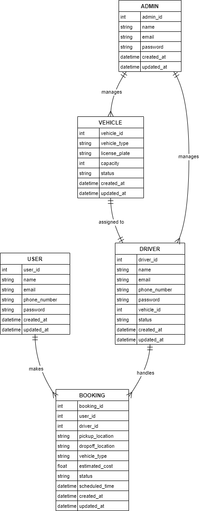

# On-Demand Logistics Platform for Goods Transportation

## Introduction

This project is a simplified version of an on-demand logistics platform that allows users to book transportation services for moving goods, connect with drivers, and track the progress of their bookings in real time. It includes core functionalities such as booking services, driver job assignments, and real-time tracking using Node.js, Express, Socket.IO, and simple HTML/CSS/JavaScript for the front end.

## Features

### User Features
- **Book a Vehicle:** Users can book a vehicle for transporting goods by specifying the pickup and drop-off locations and the type of vehicle needed.
- **Real-Time Tracking:** Once a vehicle is booked, users can track the driver's location in real time.
- **Price Estimation:** Users receive a price estimate based on distance, vehicle type, and other factors.

### Driver Features
- **Job Assignment:** Drivers can view and accept booking requests from users.
- **Job Status Updates:** Drivers can update the status of their assigned jobs (e.g., en route, goods collected, delivered).

### Admin Features
- **Fleet Management:** Admins can monitor driver activities and track bookings and vehicle statuses.
- **Data Analytics:** Admins can track the number of trips completed, average trip times, and driver performance.

## Tech Stack
- **Backend:** Node.js, Express.js
- **Frontend:** HTML, CSS, JavaScript, Bootstrap
- **Real-Time Communication:** Socket.IO for real-time driver location updates and booking status.

## Project Structure
```
logistics-demo/
├── server.js
├── package.json
├── public/
│   ├── index.html
│   ├── driver.html
│   ├── style.css
│   └── client.js
```

## Installation and Setup

1. **Clone the Repository**
   ```
   git clone <repository-url>
   cd logistics-demo
   ```

2. **Install Dependencies**
   ```
   npm install
   ```

3. **Start the Server**
   ```
   npm start
   ```

4. **Access the Application**
   - **User Interface:** Navigate to `http://localhost:3000` to access the user interface.
   - **Driver Interface:** Open a new tab and navigate to `http://localhost:3000/driver.html` for the driver dashboard.


## ER Diagram



## How to Use

### User Side (Booking a Ride)
1. Open the user interface (`index.html`).
2. Enter your **User ID**, **Pickup Location**, **Drop-off Location**, and **Vehicle Type**.
3. Click on **"Book Now"** to request a vehicle.
4. Track the driver's location in real-time using the tracking section.

### Driver Side (Accepting a Booking)
1. Open the driver interface (`driver.html`).
2. Enter your **Driver ID** and click **"Register Driver"**.
3. View available bookings and click **"Accept Booking"** to accept a ride request.
4. Update the booking status as you proceed with the ride.

## System Design Overview
This project uses a simple client-server architecture with Socket.IO for real-time communication.

- **Server-Side Logic:** Handles booking requests, pricing estimation, and driver management.
- **Real-Time Updates:** Socket.IO is used to update the status of bookings and track driver locations.
- **Database:** In-memory storage is used for simplicity. In a production environment, you would use a persistent database like MongoDB or PostgreSQL.

## High-Level Design (HLD)

The system is designed to handle requests from users, drivers, and admins while ensuring scalability, availability, and reliability. Below is an overview of the core components of the architecture:

### Architecture Components

1. **Web and Mobile Clients**: Interfaces for Users, Drivers, and Admins to interact with the platform.
   - Technologies: Web (HTML, CSS, JavaScript), Mobile (React Native or similar).

2. **API Gateway**: Acts as an entry point for all requests, forwarding them to appropriate backend services.
   - Role: Authentication, routing, rate limiting, and request aggregation.

3. **Backend Microservices**:
   - **Booking Service**: Handles ride bookings, assigns drivers, and manages booking states.
   - **Tracking Service**: Provides real-time updates on the driver's location using Socket.IO/WebSockets.
   - **Pricing Service**: Calculates estimated costs based on distance, vehicle type, and demand.
   - **Driver Service**: Manages driver status, vehicle details, and job assignments.

4. **Databases**:
   - **SQL Database (PostgreSQL)**: Stores user, driver, and booking details.
   - **NoSQL Database (MongoDB)**: Stores real-time tracking data and driver activities.
   - **Redis**: Used for caching frequent queries and session management.

5. **Load Balancer**: Distributes incoming requests across multiple servers to ensure no single server is overwhelmed.
   - Technologies: Nginx, AWS Elastic Load Balancer.

6. **Real-Time Communication**: Socket.IO or WebSockets for maintaining real-time connections between users, drivers, and the backend for continuous location tracking and booking updates.

7. **External Services**:
   - **GPS Integration**: Integration with GPS APIs for accurate driver location tracking.
   - **Payment Gateway**: Handles payments securely using services like Stripe or PayPal.

### Data Flow
1. **User Booking Request**: The user sends a booking request, which is handled by the **Booking Service**. The **Driver Service** finds an available driver, and the **Tracking Service** provides real-time updates.
2. **Driver Job Assignment**: When a user books a ride, the **Driver Service** matches the request with a nearby driver, and the driver is notified in real time.
3. **Real-Time Updates**: The **Tracking Service** provides location updates via **Socket.IO**, keeping users informed about the driver's progress.

### Scalability Considerations
- **Horizontal Scalability**: Each service can be scaled horizontally by adding more instances.
- **Service Discovery**: Tools like **Consul** or **Eureka** can be used for service discovery to facilitate easy communication between services.
- **Fault Tolerance**: Implement retry mechanisms and use circuit breakers for improved fault tolerance.

## Scalability Considerations
- **Load Balancing**: In a real-world application, you would use load balancers to handle high traffic and manage thousands of concurrent users.
- **Database Scaling**: To handle a large number of users and drivers, the database must be distributed and replicated across nodes for performance.
- **Real-Time Tracking**: For thousands of concurrent connections, you would need an efficient way to manage WebSockets and scale horizontally using cloud services like AWS or Azure.

## Improvements for Future
- **Authentication and Authorization**: Implement secure login for Users, Drivers, and Admins.
- **Persistent Storage**: Use a database such as PostgreSQL for users, drivers, and bookings data.
- **Enhanced Real-Time Tracking**: Integrate a real map API (such as Google Maps) for accurate driver tracking.
- **Payment Integration**: Include a payment gateway to handle payment transactions.

## License
This project is licensed under the MIT License - see the LICENSE file for details.

## Authors
- Raghav Bansal (JUIT, Solan)

## Acknowledgments
- **Node.js** and **Express** for backend functionality.
- **Socket.IO** for real-time communication.
- **Bootstrap** for enhancing the UI with minimal effort.


